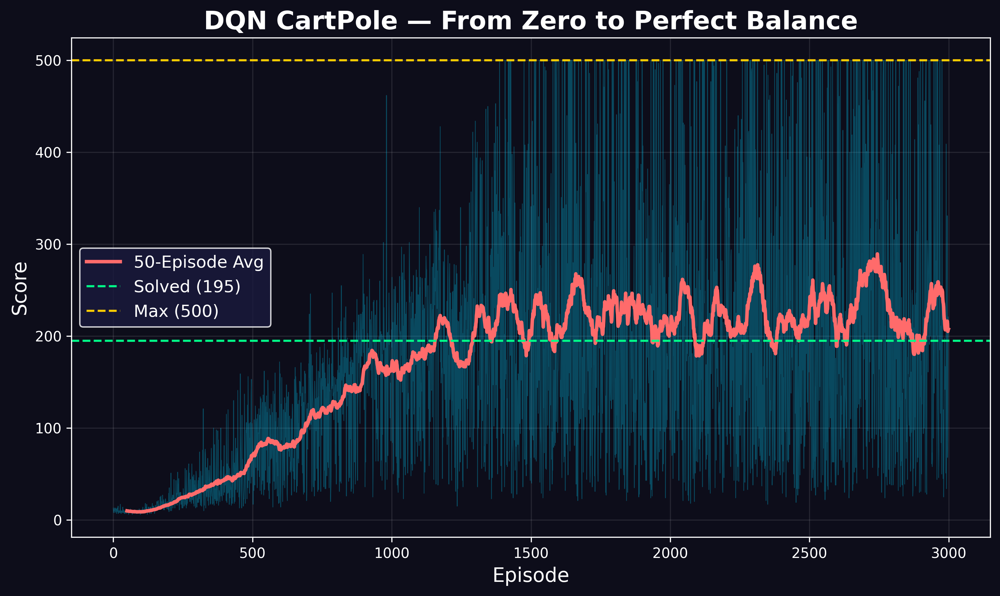

# CartPole-RL — Deep Q-Networks from Scratch

A collection of CartPole projects built entirely from scratch — custom physics, DQN architectures, and real-time visualizations. No PyTorch. No TensorFlow. Just NumPy and the math.

## Projects

| Project | Environment | Physics | Highlights |
|---------|-------------|---------|------------|
| [DefaultGymCartPole](DefaultGymCartPole/) | Gymnasium | Built-in | Perfect 500/500, multiple architectures explored |
| [WindyCartPole](WindyCartPole/) | Custom from scratch | Custom with wind | Tilted equilibrium, wind visualization |

---

# DefaultGymCartPole — DQN from Scratch

A from-scratch Deep Q-Network that learns to balance a pole on a cart through pure reinforcement learning. Trained on 1,000 episodes with no ML frameworks — just NumPy and the math. Achieves a perfect 500/500 score on CartPole-v1, maxing out the environment.


### Project Structure (DefaultGymCartPole)

```
DefaultGymCartPole/
├── final.py                  # Final DQN (tanh, batched, target network, perfect 500)
├── CartPole0gym.py           # Initial DQN attempt (ReLU, single-sample training)
├── NeuralNetwork.py          # Early DQN class (ReLU, single-sample)
├── DQN_cartpole.png          # Training progress plot (0 → 500)
└── README.md
```

### How It Works

**State**: 4 numbers — cart position, cart velocity, pole angle, pole angular velocity
**Actions**: 0 (push left) or 1 (push right)
**Reward**: +1 for every timestep the pole stays up
**Solved**: Average score ≥ 195 over 100 consecutive episodes
**Maximum**: 500 timesteps

### DQN Architecture

```
Input:  4 (state vector)
Hidden: 64 (tanh)
Hidden: 64 (tanh)
Output: 2 (Q-value for push left, Q-value for push right)
```

### Results

| Episode | Average Score | Status |
|---------|---------------|--------|
| 50 | 27.2 | Random flailing |
| 150 | 120.9 | Starting to balance |
| 300 | 223.8 | **Solved!** (≥195) |
| 550 | 500.0 | **Perfect!** (maxed out) |

### What Went Wrong (And How We Fixed It)

**Attempt 1 (ReLU + Single-Sample)**: Scores 10-25, never improved. No target network.

**Attempt 2 (Target Network + 4x Training)**: Stuck at 20-25. Learning rate too low.

**Attempt 3 (Batched Training)**: Scores fluctuated, occasional spikes to 144.

**Final Fix (Tanh + Xavier Init + Proper LR)**: Scores climbed smoothly 27 → 121 → 224 → 407 → 500. Perfect 500 maintained from episode 550 onward.

### Lessons Learned

- **Tanh > ReLU** for this control problem — bounded activations prevent gradient explosions
- **Target networks are essential** — without them, the Q-function chases a moving target
- **Batch training** is more stable and faster than single-sample updates
- **Hyperparameter sensitivity is real** — lr=0.005 failed, lr=0.001 worked perfectly

---

# WindyCartPole — DQN with Custom Physics & Wind

A fully from-scratch CartPole environment with wind force, trained with a custom DQN. Every line — physics simulation, neural network, training loop, and visualization — built with NumPy and Matplotlib. No Gymnasium physics. No PyTorch. No RL libraries.



### Project Structure (WindyCartPole)

```
WindyCartPole/
├── Simulation.py      # DQN training + animation + training plot
├── Environment.py     # Custom CartPole physics with wind
└── README.md
```

### The Windy CartPole

Standard CartPole: balance a pole on a cart by pushing left or right.

**Windy CartPole**: a constant wind blows left to right. The wind force is proportional to the pole's exposed cross-sectional area — when the pole is vertical, the wind hits it hardest. When the pole tilts, less surface area faces the wind.

The agent must learn to lean the pole INTO the wind to maintain balance — a tilted equilibrium that doesn't exist in the standard environment.

### Physics

```
Wind force = wind_strength × |cos(θ)| × pole_length
Total force = control_force + wind_force
```

### Modifications from Standard CartPole

| Feature | Standard | Windy |
|---------|----------|-------|
| Wind force | 0 | 9.0 N (configurable) |
| Failure angle | 0.21 rad (12°) | 0.30 rad (17°) |
| Equilibrium | Vertical | Tilted into wind |

### DQN Architecture

```
Input:  4 (state vector)
Hidden: 64 (tanh)
Hidden: 64 (tanh)
Output: 2 (Q-value for push left, Q-value for push right)
```

Tanh activations with Xavier initialization. Target network synced every 100 steps. Replay buffer of 20,000 experiences. Batch size of 64.

### Results

With wind = 9.0 N (90% of the control force), the DQN achieves ~240 average score. At wind = 10.0 N, the physics becomes unsolvable — wind force equals control force, and the cart cannot overcome the wind when the pole is near vertical.

The agent discovers the tilted equilibrium strategy: lean the pole slightly left, let the wind push on the tilted surface, and make small adjustments. This behavior emerges purely from trial and error — no physics knowledge is encoded in the network.

### Visualization

The simulation includes:
- **Live cart and pole** with real-time physics
- **Wind particles** blowing left to right, opacity varying with wind strength
- **Wind arrows** pulsing across the screen
- **Wind strength bar** showing current force in Newtons
- **Score and angle display** updated every frame

---

## Usage

### DefaultGymCartPole
```bash
cd DefaultGymCartPole
python final.py
```

### WindyCartPole
```bash
cd WindyCartPole
python Simulation.py
```

## Dependencies

```bash
pip install numpy gymnasium matplotlib
```

## Why This Matters

Standard CartPole is a solved benchmark. Adding wind creates a non-standard equilibrium that the agent must discover. The tilted balance strategy is not programmed — it emerges from the interaction of physics, reward, and neural network training.

This is the same principle behind:
- Drone stabilization in crosswinds
- Rocket landing with atmospheric drag
- Robot walking on uneven terrain

The environment changes. The algorithm adapts. That's reinforcement learning.

## What's Next

- Gusting wind (variable force, not constant)
- Wind direction changes during episode
- Double Pendulum (two poles)
- Physics built from Lagrangian mechanics
