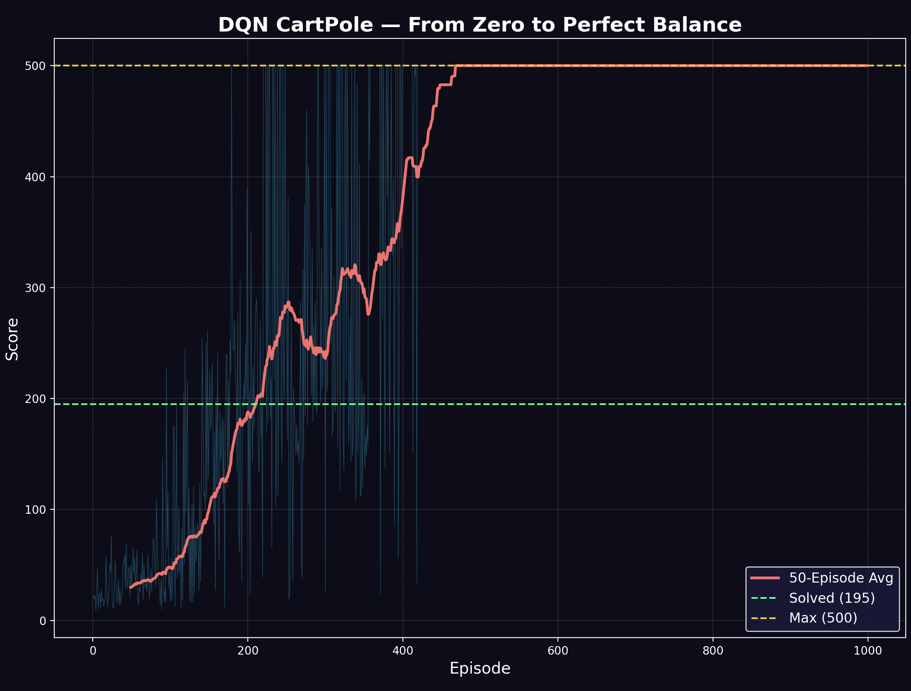

# CartPole DQN — Deep Q-Network from Scratch

A from-scratch Deep Q-Network that learns to balance a pole on a cart through pure reinforcement learning. Trained on 1,000 episodes with no ML frameworks — just NumPy and the math. Achieves a perfect 500/500 score on CartPole-v1, maxing out the environment.



## Project Structure

```
├── final.py                  # Final DQN (tanh, batched, target network, perfect 500)
├── CartPole0gym.py           # Initial DQN attempt (ReLU, single-sample training)
├── NeuralNetwork.py          # Early DQN class (ReLU, single-sample)
├── DQN cartpole png.png      # Training progress plot (0 → 500)
└── README.md
```

## How It Works

### The CartPole Problem

A cart moves along a track. A pole is attached to the cart by an unactuated joint. The agent can push the cart left or right. The goal: keep the pole balanced as long as possible.

- **State**: 4 numbers — cart position, cart velocity, pole angle, pole angular velocity
- **Actions**: 0 (push left) or 1 (push right)
- **Reward**: +1 for every timestep the pole stays up
- **Solved**: Average score ≥ 195 over 100 consecutive episodes
- **Maximum**: 500 timesteps (environment cap)

### The DQN Architecture

```
Input:  4 (state vector)
Hidden: 64 (tanh)
Hidden: 64 (tanh)
Output: 2 (Q-value for push left, Q-value for push right)
```

Tanh activations with Xavier initialization. Target network synced every 100 steps. Replay buffer of 20,000 experiences. Batch size of 64.

### Training (Temporal Difference Learning)

```
For each timestep:
    1. Select action using epsilon-greedy
    2. Execute action, observe reward and next state
    3. Store (state, action, reward, next_state, done) in replay buffer
    4. Sample random batch of 64 from buffer
    5. Compute target: r + γ × max Q_target(next_state)
    6. Update network weights via gradient descent

Target network syncs every 100 steps to stabilize learning.
```

- **Gamma**: 0.99
- **Epsilon**: 1.0 → 0.01 (decay 0.995 per episode)
- **Learning rate**: 0.001
- **Episodes**: 1,000

## Results

| Episode | Average Score | Status |
|---------|---------------|--------|
| 50 | 27.2 | Random flailing |
| 150 | 120.9 | Starting to balance |
| 300 | 223.8 | **Solved!** (≥195) |
| 550 | 500.0 | **Perfect!** (maxed out) |
| 1000 | 500.0 | Maintained perfectly |

The agent went from complete inability (score ~20) to flawless control (score 500) in ~550 episodes. After crossing the solved threshold at episode 300, it continued improving until maxing out the environment.

## What Went Wrong (And How We Fixed It)

### Attempt 1: ReLU + Single-Sample Training (CartPole0gym.py)
- Scores oscillated between 10-25, never improved
- No target network caused instability
- Single-sample updates were noisy

### Attempt 2: Target Network + 4x Training
- Scores still stuck around 20-25
- Learning rate too low (0.001 with ReLU)

### Attempt 3: Batched Training
- Added proper batch processing
- Scores fluctuated wildly, occasional spikes to 144

### Final Fix: Tanh + Xavier Init + Proper LR
- Switched from ReLU to tanh for bounded activations
- Kept learning rate at 0.001
- Scores climbed smoothly: 27 → 121 → 224 → 407 → 500
- Perfect 500 maintained from episode 550 onward

## Usage

### Train

```bash
python final.py
```

### Watch a trained model

```python
env = gym.make('CartPole-v1', render_mode='human')
s, _ = env.reset()
for _ in range(500):
    a = np.argmax(model.forward(s))
    s, _, done, _, _ = env.step(a)
    if done:
        break
env.close()
```

## Dependencies

```bash
pip install numpy gymnasium matplotlib
```

## Lessons Learned

- **Tanh > ReLU** for this control problem — bounded activations prevent gradient explosions
- **Target networks are essential** — without them, the Q-function chases a moving target
- **Batch training** is more stable and faster than single-sample updates
- **Hyperparameter sensitivity is real** — lr=0.005 failed, lr=0.001 worked perfectly
- **CartPole is finicky** — the same DQN that crushed Wordle needed significant tuning here

## What's Next

- Build the CartPole physics simulation from scratch (no Gymnasium)
- Add an animated Matplotlib visualization of the cart and pole balancing
- Try Double DQN and Dueling DQN architectures
